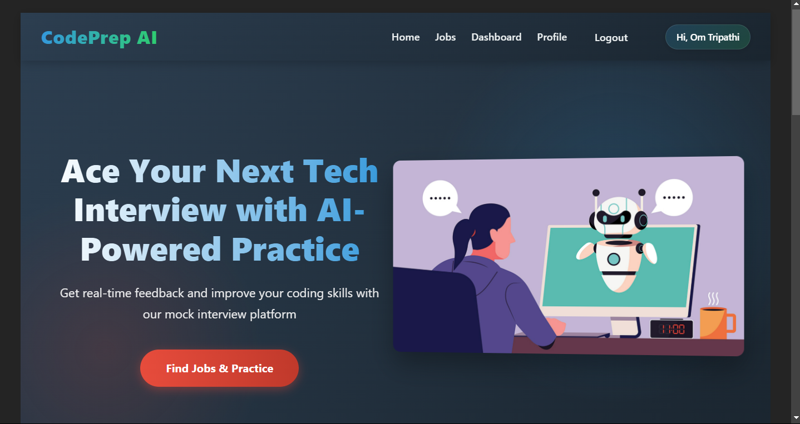
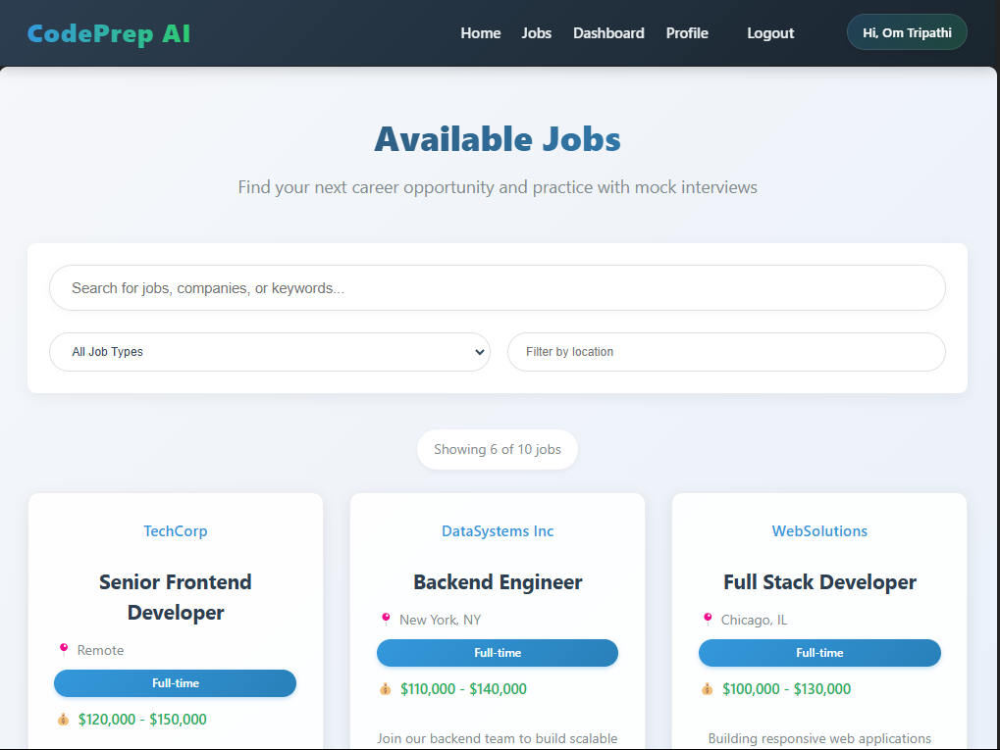
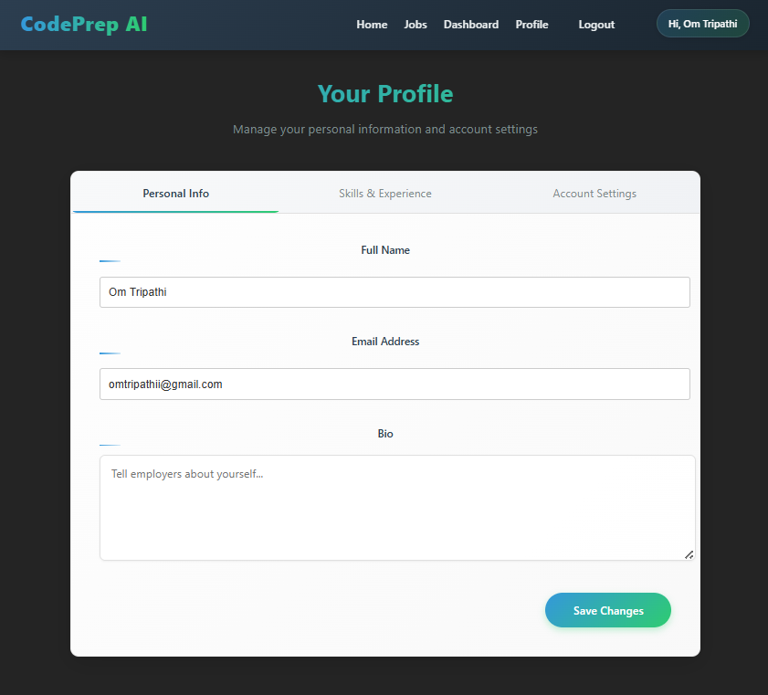
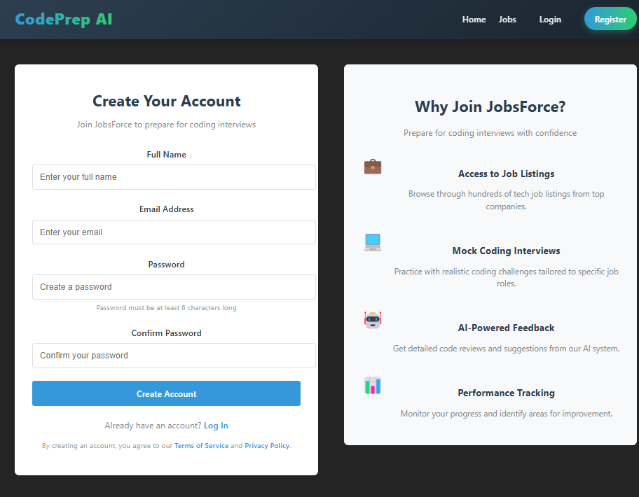
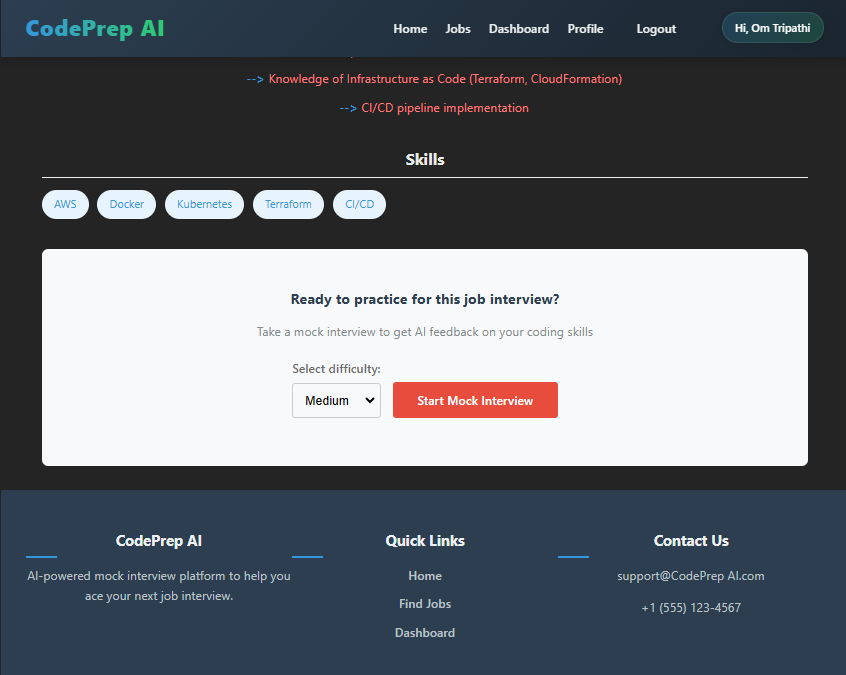
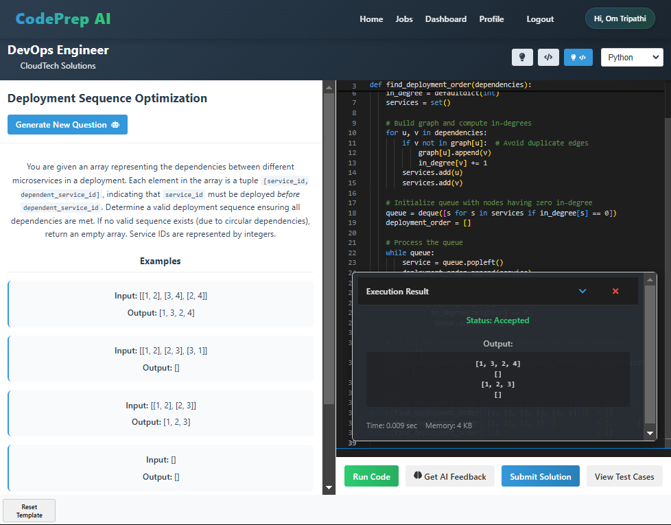
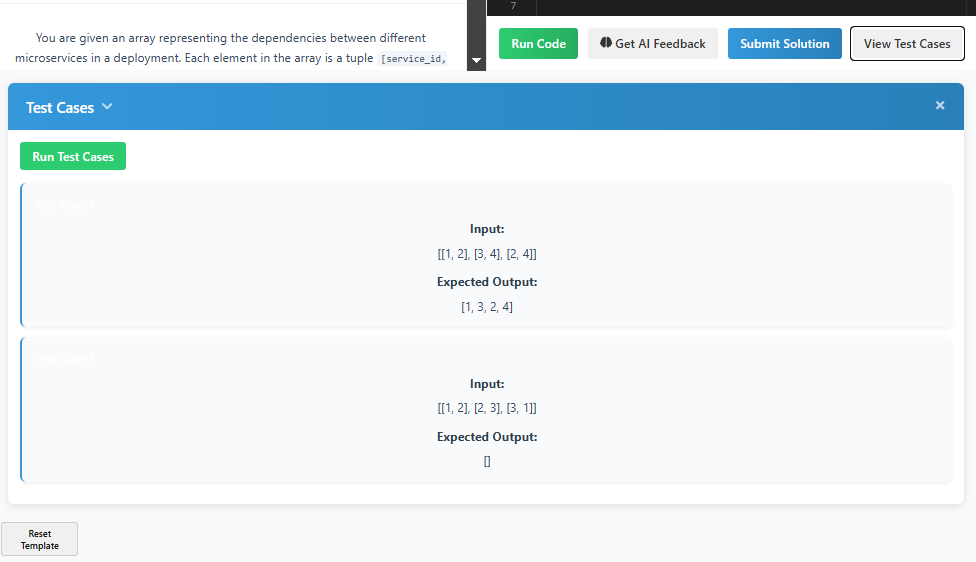
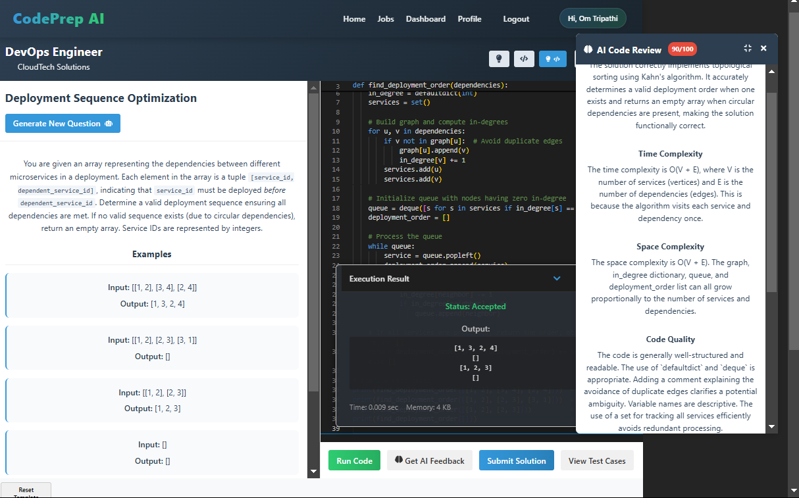

# 🚀 CodePrepAI


> An AI-powered coding interview preparation platform designed to help developers excel in technical interviews through realistic mock interviews, real-time code execution, and AI-enhanced feedback.


[](https://opensource.org/licenses/MIT)
[](https://codeprepai.dev-om.live)

## 📋 Table of Contents

- [Features](#-features)
- [Screenshots](#-screenshots)
- [Tech Stack](#-tech-stack)
- [System Architecture](#-system-architecture)
- [Setup Instructions](#-setup-instructions)
- [Deployment](#-deployment)
- [CI/CD Pipeline](#-cicd-pipeline)
- [Project Structure](#-project-structure)
- [Contributing](#-contributing)
- [License](#-license)

## ✨ Features

### Core Features
- **🤖 AI-Generated Coding Questions**: Dynamic questions generated based on job descriptions
- **💻 Real-time Code Execution**: Test your code instantly across multiple programming languages
- **📊 AI-powered Code Feedback**: Get detailed insights on your solution's efficiency, style, and areas for improvement
- **🧩 Automatic Test Cases**: AI-generated test cases to validate your solutions thoroughly
- **👔 Job-Specific Practice**: Practice with questions tailored to actual job listings
- **📱 Responsive Design**: Seamless experience across desktop and mobile devices

### Development Highlights
- **Backend**
  - ✅ Node.js + Express.js – RESTful APIs for fetching jobs and handling code submissions
  - ✅ MongoDB – Efficient storage for user profiles, attempts, and feedback
  - ✅ AI Model Integration – Advanced AI-based review system
  - ✅ Coding Compiler API – Judge0 integration for secure code execution
  - ✅ Efficient API handling – Optimized for scalability and performance

- **DevOps & AWS**
  - ✅ Backend deployed on AWS EC2
  - ✅ CI/CD pipeline using GitHub Actions
  - ✅ Secure code execution to prevent malicious inputs

- **Frontend**
  - ✅ LeetCode-style UI using React.js – Intuitive left panel (question) & right panel (editor)
  - ✅ Language selection dropdown supporting multiple programming languages
  - ✅ Smooth UX with real-time feedback after submission

### Bonus Features
- 🌟 AI-automated question generation based on job descriptions
- 🌟 AI-generated test cases with comprehensive validation
- 🌟 Enhanced AI review system with detailed improvement suggestions

## 📸 Screenshots

### Homepage
<p align="center">
  
  <br>
  <em>The landing page showcasing the platform's key features and benefits</em>
</p>

### Jobs Listing
<p align="center">
  
  <br>
  <em>Browse through a collection of job listings for targeted interview practice</em>
</p>

### Profile Management
<p align="center">
  
  <br>
  <em>User profile customization with skills, preferences, and progress tracking</em>
</p>

### Authentication
<p align="center">
  
  <br>
  <em>Secure login and registration process with JWT authentication</em>
</p>

### Question Types
<p align="center">
  
  <br>
  <em>Various question types including algorithms, data structures, and system design</em>
</p>

### Code Editor
<p align="center">
  
  <br>
  <em>Advanced code editor with syntax highlighting, autocompletion, and real-time execution</em>
</p>

### AI Test Cases
<p align="center">
  
  <br>
  <em>Intelligent test cases generated by AI to thoroughly validate solutions</em>
</p>

### AI Feedback
<p align="center">
  
  <br>
  <em>Comprehensive code review and suggestions provided by the AI system</em>
</p>

## 🛠 Tech Stack

### Frontend
- **React.js**: Building responsive UI components
- **Vite**: Fast development and optimized builds
- **Styled Components**: Maintaining consistent UI design
- **Axios**: Handling API requests efficiently
- **Monaco Editor**: Feature-rich code editor with syntax highlighting

### Backend
- **Node.js**: JavaScript runtime for server-side logic
- **Express.js**: Web framework for REST API development
- **MongoDB**: NoSQL database for flexible data storage
- **Mongoose**: Elegant MongoDB object modeling
- **JWT**: Secure authentication mechanism
- **Google Gemini API**: Advanced AI capabilities for code analysis
- **Judge0 API**: Secure code execution environment

### DevOps
- **AWS EC2**: Hosting the application backend
- **Vercel**: Frontend deployment platform
- **NGINX**: Web server and reverse proxy
- **PM2**: Process manager for Node.js applications
- **GitHub Actions**: CI/CD automation
- **Let's Encrypt**: SSL certificate management

## 🏗 System Architecture

```
                   ┌─────────────┐
                   │   Vercel    │
                   │  (Frontend) │
                   └──────┬──────┘
                          │
                          ▼
┌────────────┐     ┌──────────────┐     ┌─────────────┐
│  Browser   │◄────│     HTTPS    │────►│   NGINX     │
└────────────┘     └──────────────┘     └──────┬──────┘
                                               │
                                               ▼
┌────────────┐     ┌──────────────┐     ┌─────────────┐
│  MongoDB   │◄────│   Node.js    │◄────│    PM2      │
└────────────┘     │   Express    │     └─────────────┘
                   └──────┬───────┘
                          │
         ┌────────────────┼────────────────┐
         ▼                ▼                ▼
┌─────────────┐   ┌──────────────┐  ┌─────────────┐
│  Judge0 API │   │  Google      │  │ Other APIs  │
│(Code Exec)  │   │  Gemini API  │  │             │
└─────────────┘   └──────────────┘  └─────────────┘
```

## 🔧 Setup Instructions

### Prerequisites
- Node.js (v16.x or higher)
- MongoDB (v4.4 or higher)
- npm (v7.x or higher)
- Git

### Installation

1. **Clone the repository**
   ```bash
   git clone https://github.com/omtripathii/codeprepai.git
   cd codeprepai
   ```

2. **Install server dependencies**
   ```bash
   npm install
   ```

3. **Install client dependencies**
   ```bash
   cd client
   npm install
   ```

4. **Set up environment variables**
   
   Create `.env` file in the server directory:
   ```bash
   cd ../server
   touch .env
   ```
   
   Add the following environment variables:
   ```
   MONGODB_URI=mongodb://localhost:27017/codeprepai
   JWT_SECRET=your_jwt_secret
   PORT=5000
   NODE_ENV=development
   GEMINI_API_KEY=your_gemini_api_key
   JUDGE0_API_KEY=your_judge0_api_key
   ```

5. **Start the development servers**
   
   In the root directory:
   ```bash
   # Start backend server
   npm run server
   
   # In another terminal, start frontend
   cd client
   npm run dev
   ```

6. **Access the application**
   
   Open your browser and navigate to `http://localhost:5173`

## 🚀 Deployment

The application is deployed and accessible at [https://codeprepai.dev-om.live](https://codeprepai.dev-om.live)

### Backend Deployment (AWS EC2)
- Instance: Ubuntu 24 LTS
- Web Server: NGINX as reverse proxy
- Process Management: PM2
- SSL: Let's Encrypt certificates
- Domain: api.codeprepai.dev-om.live

### Frontend Deployment (Vercel)
- Platform: Vercel
- Domain: codeprepai.dev-om.live
- Environment: Production
- Build Command: `npm run build`

## 🔄 CI/CD Pipeline

The project uses GitHub Actions for continuous integration and deployment:

```yaml
name: 🚀 Refresh Backend Deployment

on:
  push:
    branches: [main]
  workflow_dispatch:

jobs:
  refresh:
    runs-on: ubuntu-latest
    steps:
      - name: 🔑 Setup SSH Key
        run: |
          # SSH key setup...
          
      - name: 🔄 Update Repository and Restart Services
        run: |
          # Connect to EC2
          # Pull latest changes
          # Restart services
```

## 📁 Project Structure

```
codeprepai/
├── .github/            # GitHub Actions workflows
├── client/             # React frontend
│   ├── public/         # Static assets
│   ├── src/            # Source files
│   │   ├── components/ # React components
│   │   ├── context/    # Context providers
│   │   ├── pages/      # Page components
│   │   ├── utils/      # Utility functions
│   │   └── App.jsx     # Main application component
│   ├── .env.production # Production environment variables
│   └── package.json    # Frontend dependencies
├── server/             # Node.js backend
│   ├── models/         # Mongoose models
│   ├── routes/         # API routes
│   ├── utils/          # Utility functions
│   ├── server.js       # Server entry point
│   └── package.json    # Backend dependencies
└── README.md           # Project documentation
```

## 👥 Contributing

Contributions are welcome! Please feel free to submit a Pull Request.

1. Fork the repository
2. Create your feature branch (`git checkout -b feature/amazing-feature`)
3. Commit your changes (`git commit -m 'Add some amazing feature'`)
4. Push to the branch (`git push origin feature/amazing-feature`)
5. Open a Pull Request

## 📄 License

This project is licensed under the MIT License - see the LICENSE file for details.

---

<p align="center">
  Built with ❤️ by <a href="https://github.com/omtripathii">Om Tripathi</a>
</p>
